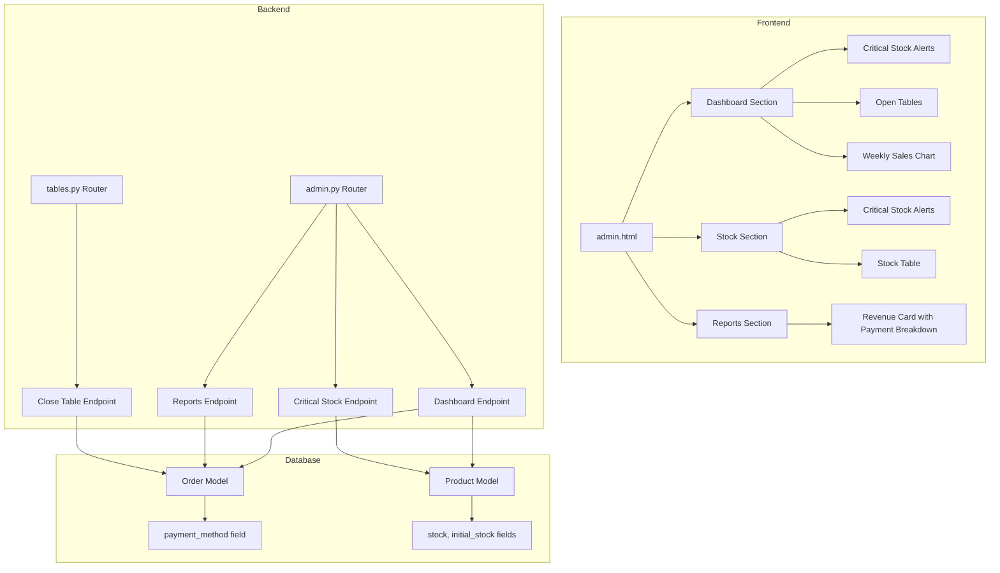

# Design Document

## Overview

Bu tasarım, restoran yönetim sistemine iki ana özellik ekler:

1. **Ödeme Yöntemi Takibi**: Siparişler kapatılırken ödeme yöntemi (nakit/kredi kartı) kaydedilecek ve raporlarda bu dağılım gösterilecek
2. **Kritik Stok Uyarıları**: Stok seviyesi %20'nin altına düşen ürünler için görsel uyarılar Dashboard ve Stok sekmelerinde gösterilecek

## Architecture



## Components and Interfaces

### Backend Components

#### 1. Order Model Extension
- Yeni alan: `payment_method` (String, nullable, values: "cash" | "card")

#### 2. Product Model Extension
- Yeni alan: `initial_stock` (Integer, default: 0) - Ürünün başlangıç stok miktarı

#### 3. Admin Router - New Endpoints

**GET /api/admin/critical-stock**
```json
Response:
{
  "critical_products": [
    {
      "id": 1,
      "name": "Coca Cola",
      "current_stock": 5,
      "initial_stock": 50,
      "percentage": 10
    }
  ]
}
```

**GET /api/admin/reports/sales (Extended)**
```json
Response:
{
  "total_revenue": 15000.00,
  "cash_total": 9000.00,
  "card_total": 6000.00,
  "total_orders": 150,
  ...existing fields...
}
```

#### 4. Tables Router - Close Table Extension

**POST /api/tables/close/{table_id}**
```json
Request Body:
{
  "payment_method": "cash" | "card"
}
```

### Frontend Components

#### 1. CSS Animation
```css
@keyframes criticalPulse {
  0%, 100% { border-color: #ef4444; box-shadow: 0 0 0 0 rgba(239, 68, 68, 0.7); }
  50% { border-color: #dc2626; box-shadow: 0 0 0 10px rgba(239, 68, 68, 0); }
}
.critical-stock-alert {
  animation: criticalPulse 1.5s ease-in-out infinite;
  border: 3px solid #ef4444;
}
```

#### 2. Dashboard Section Layout (Yeni Sıralama)
1. İstatistik Kartları (mevcut)
2. Kritik Stok Uyarıları (YENİ)
3. Açık Masalar (mevcut - yukarı taşındı)
4. Haftalık Satış Grafiği (mevcut)

#### 3. Stock Section Layout (Yeni Sıralama)
1. Kritik Stok Uyarıları (YENİ)
2. Stok Tablosu (mevcut)

#### 4. Reports Section - Revenue Card Update
```
┌─────────────────────────────┐
│ Toplam Ciro                 │
│ 15,000.00 ₺                 │
│ ─────────────────────────── │
│ 💵 Nakit: 9,000.00 ₺        │
│ 💳 Kredi Kartı: 6,000.00 ₺  │
└─────────────────────────────┘
```

## Data Models

### Order Model (Extended)
```python
class Order(Base):
    # ...existing fields...
    payment_method = Column(String, nullable=True)  # "cash" or "card"
```

### Product Model (Extended)
```python
class Product(Base):
    # ...existing fields...
    initial_stock = Column(Integer, default=0)  # Başlangıç stok miktarı
```

## Correctness Properties

*A property is a characteristic or behavior that should hold true across all valid executions of a system-essentially, a formal statement about what the system should do. Properties serve as the bridge between human-readable specifications and machine-verifiable correctness guarantees.*

### Property 1: Payment method persistence
*For any* order that is closed with a payment method, querying that order from the database should return the same payment method that was used to close it.
**Validates: Requirements 1.4**

### Property 2: Payment breakdown sum equals total revenue
*For any* set of orders in a date range, the sum of cash_total and card_total should equal total_revenue (excluding orders without payment method).
**Validates: Requirements 1.5**

### Property 3: Critical stock classification threshold
*For any* product where track_stock is true and current stock is less than or equal to 20% of initial_stock, the product should be classified as critical stock.
**Validates: Requirements 2.1**

### Property 4: Critical stock alert content
*For any* product classified as critical stock, the rendered alert card should contain the product name and current stock quantity.
**Validates: Requirements 2.4, 3.3**

## Error Handling

| Scenario | Handling |
|----------|----------|
| Order closed without payment method | Store null, exclude from payment breakdown |
| Product with initial_stock = 0 | Skip critical stock calculation for that product |
| API endpoint failure | Show toast notification, maintain current UI state |
| Invalid payment method value | Reject request with 400 Bad Request |

## Implementation Safety Guidelines

**KRİTİK: Mevcut uygulamanın çalışmasını bozmamak için aşağıdaki kurallara uyulmalıdır:**

1. **Geriye Dönük Uyumluluk**: 
   - `payment_method` alanı: Mevcut siparişlerde bu alan boş (NULL) kalacak, sistem eski siparişleri sorunsuz göstermeye devam edecek
   - `initial_stock` alanı: Mevcut ürünlerde varsayılan olarak mevcut `stock` değeri kullanılacak
   - Raporlarda ödeme yöntemi olmayan siparişler "Belirtilmemiş" olarak gösterilecek

2. **Mevcut Endpoint'leri Koruma**: Yeni alanlar mevcut response'lara eklenmeli, mevcut alanlar değiştirilmemeli

3. **Frontend Değişiklikleri**: Mevcut HTML yapısı korunmalı, yeni bölümler mevcut bölümlerin arasına eklenmeli

4. **CSS İzolasyonu**: Yeni CSS sınıfları mevcut stilleri etkilememeli

5. **JavaScript Fonksiyonları**: Mevcut fonksiyonlar değiştirilmemeli, yeni fonksiyonlar eklenmeli

6. **Database Migration**: Alembic migration ile güvenli şekilde yeni alanlar eklenmeli, mevcut veriler korunacak

## Testing Strategy

### Unit Tests
- Test critical stock calculation logic with various stock levels
- Test payment breakdown calculation with mixed payment methods
- Test API endpoint responses

### Property-Based Tests
Property-based testing will use Python's `hypothesis` library for backend tests.

**Property Tests to Implement:**
1. Payment method round-trip: Close order with payment method, verify it's stored correctly
2. Payment breakdown invariant: Sum of cash + card = total (for orders with payment methods)
3. Critical stock threshold: Products at or below 20% are always classified as critical
4. Alert content completeness: All critical products have name and stock in rendered output

### Integration Tests
- Test full flow: Close table with payment method → Verify in reports
- Test stock update → Critical alerts refresh
