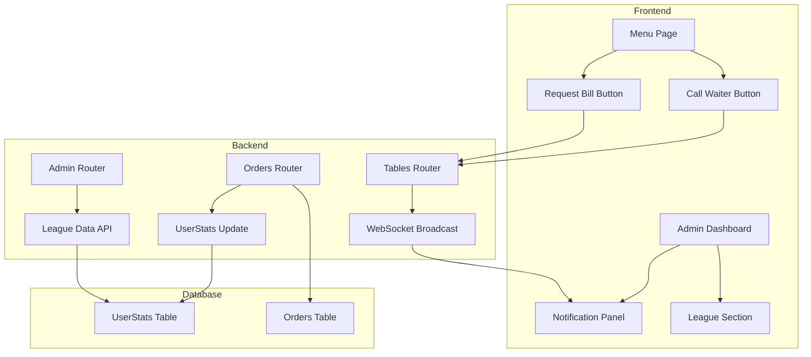

# Design Document: Waiter League & Notifications

## Overview

Bu tasarım, garson performans takip sistemi (garson ligi) ve müşteri bildirim sistemini kapsamaktadır. Sistem, garsonların sipariş bazlı puanlarını takip edecek, müşteri çağrılarını ve hesap isteklerini dashboard üst barında gösterecektir.

## Architecture



## Components and Interfaces

### 1. Backend Components

#### 1.1 Orders Router (backend/routers/orders.py)
- **create_order**: Sipariş oluşturulduğunda waiter_id'ye göre UserStats.total_orders +1
- **update_order_status**: Sipariş iptal edildiğinde UserStats.total_orders -1 (minimum 0)

#### 1.2 Admin Router (backend/routers/admin.py)
- **GET /api/admin/league**: Garson ligi verilerini döndürür (bahşiş olmadan)
  - Response: `[{user_id, username, full_name, total_orders}]`
  - Sıralama: total_orders DESC

#### 1.3 Tables Router (backend/routers/tables.py)
- **POST /api/tables/{table_id}/call-waiter**: Mevcut endpoint (değişiklik yok)
  - WebSocket ile admin paneline bildirim gönderir

### 2. Frontend Components

#### 2.1 Admin Dashboard Header (frontend/static/admin.html)
- **Notification Panel**: Üst barda sabit bildirim alanı
  - Bildirim listesi (waiter_call ve bill_request)
  - Her bildirimde: masa adı, tip ikonu, zaman, sil butonu
  - Renk kodlaması: turuncu (garson), mor (hesap)

#### 2.2 League Section (frontend/static/admin.html)
- **loadLeague()**: Güncellenmiş fonksiyon
  - Bahşiş sütunu kaldırılacak
  - Sadece kullanıcı adı ve puan (total_orders) gösterilecek

### 3. WebSocket Events

| Event Type | Payload | Description |
|------------|---------|-------------|
| waiter_call | {table_name, table_number, timestamp, message} | Garson çağrısı |
| bill_request | {table_name, table_number, timestamp, message} | Hesap isteği |

## Data Models

### UserStats (Mevcut - Güncelleme)
```python
class UserStats(Base):
    __tablename__ = "user_stats"
    id = Column(Integer, primary_key=True)
    user_id = Column(Integer, ForeignKey("users.id"), unique=True)
    total_orders = Column(Integer, default=0)  # Puan olarak kullanılacak
    total_sales_score = Column(Float, default=0.0)  # Opsiyonel
    total_tips_collected = Column(Float, default=0.0)  # Kullanılmayacak
```

### Frontend Notification Object
```javascript
{
    id: string,           // Unique ID for deletion
    type: string,         // 'waiter_call' | 'bill_request'
    table_name: string,
    table_number: number,
    timestamp: string,    // HH:MM format
    message: string
}
```

## Correctness Properties

*A property is a characteristic or behavior that should hold true across all valid executions of a system-essentially, a formal statement about what the system should do. Properties serve as the bridge between human-readable specifications and machine-verifiable correctness guarantees.*

### Property 1: Order submission increments waiter score
*For any* waiter and any valid order, when the order is submitted by that waiter, the waiter's total_orders count should increase by exactly 1.
**Validates: Requirements 1.1**

### Property 2: Order cancellation decrements waiter score (non-negative)
*For any* waiter with existing orders, when an order is cancelled, the waiter's total_orders count should decrease by 1, but never go below 0.
**Validates: Requirements 1.2, 1.3**

### Property 3: League sorting by score
*For any* list of waiters with scores, the league display should return them sorted by total_orders in descending order.
**Validates: Requirements 1.4**

### Property 4: Notification delivery for customer calls
*For any* table and call type (waiter_call or bill_request), when a customer initiates a call, a notification with the correct type, table info, and timestamp should be delivered via WebSocket.
**Validates: Requirements 3.1, 3.2, 3.3, 3.4**

### Property 5: Notification deletion preserves other notifications
*For any* set of notifications, when one notification is deleted, all other notifications should remain unchanged in the list.
**Validates: Requirements 4.2, 4.3**

### Property 6: Notification accumulation
*For any* sequence of incoming notifications, each new notification should be added to the existing list without removing previous notifications.
**Validates: Requirements 5.4**

## Error Handling

| Scenario | Handling |
|----------|----------|
| Waiter not found during order | Order proceeds without waiter_id, no score update |
| UserStats record missing | Create new record with total_orders=0 |
| WebSocket disconnected | Auto-reconnect after 3 seconds |
| Notification deletion fails | Show error toast, keep notification |

## Testing Strategy

### Unit Tests
- Test UserStats increment/decrement logic
- Test league sorting function
- Test notification object creation

### Property-Based Tests
Library: **Hypothesis** (Python) for backend, **fast-check** (JavaScript) for frontend

**Backend Tests:**
- Property 1: Generate random waiter IDs and orders, verify score increment
- Property 2: Generate random cancellation scenarios, verify score decrement with floor at 0
- Property 3: Generate random waiter lists with scores, verify sorting

**Frontend Tests:**
- Property 4: Generate random notification events, verify delivery
- Property 5: Generate random notification lists and deletions, verify preservation
- Property 6: Generate random notification sequences, verify accumulation

Each property-based test should run minimum 100 iterations and be tagged with the format:
`**Feature: waiter-league-notifications, Property {number}: {property_text}**`
